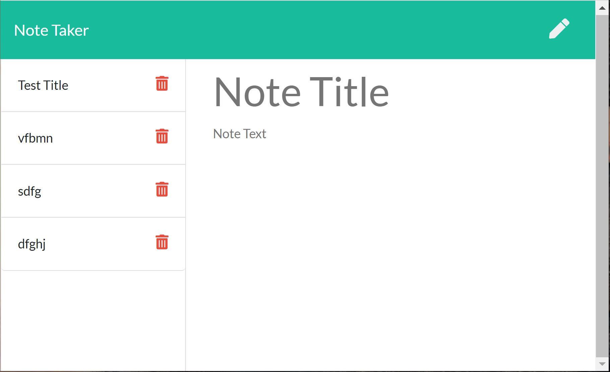

# Note Taker

AS A user, I want to be able to write and save notes;

I WANT to be able to delete notes I've written before;

SO THAT I can organize my thoughts and keep track of tasks I need to complete.

[Link to Video]()

## Table of Content
* [Description](#Description)

* [Installation](#Installation)

* [Question](#Question)

## Description
For users that need to keep track of a lot of information, it's easy to forget or be unable to recall something important. Being able to take persistent notes allows users to have written information available when needed.
   

## Installation:
After download the project, run `npm install` in terminal. Do not forget to run it at the same directory which your downloaded folder is. Then, write `node server.js` to run! 

## Question?
If you have any question or require any further information, feel free to contact me. 

GitHub: https://github.com/karimi65

Email: ali216k@gmail.com
